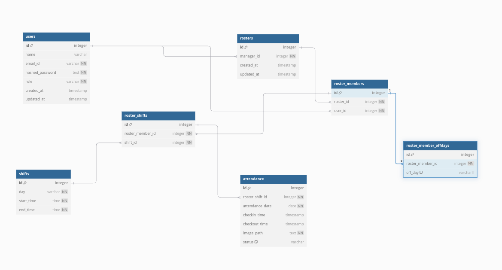

## Overview

The **Attendance Management System with Image Capture** is a web application designed to streamline attendance tracking and roster management in workplaces. It features role-based authentication, roster creation by managers, and attendance marking with image capture by staff. This ensures an efficient and tamper-proof way to manage staff attendance.

---

## Features

### Authentication & Authorization
- **Roles:** Manager, Staff, ADMIN.
- Managers can:
  - Create, view, and edit rosters.
  - Add new staff members.
  - Set working days, shifts, and weekly offs.
- Staff can:
  - View their assigned shifts.
  - Mark attendance via webcam within an hour of their shift timings.
- Admin can:
	- Create Manager user 
	- Same permission as Manager

### Roster Management
- Managers:
  - Add and manage staff details.
  - Set unique shifts for different days of the week.
  - Assign 1-2 weekly offs for each staff member.
  - View and update the complete roster.
- Staff:
  - Request shift interchange with other staff members.

### Attendance Management
- Staff members:
  - Mark attendance by capturing an image using a webcam.
  - Attendance is timestamped and linked with the captured image.
- System ensures:
  - Attendance is marked only within 1 hour of shift timings.

---

## Technologies Used

### Backend
- **Programming Language:** Python
- **Framework:** FastAPI
- **Database:** PostgreSQL
- **Authentication:** JWT-based token authentication

## Installation

1. **Clone the Repository**
   ```bash
   git clone https://github.com/RamandeepPrime/roadcast_attendance_dashboard.git
   cd roadcast_attendance_dashboard

2. **Setup Backend**
	1. Install dependencies:
		```bash 
		pip install -r requirements.txt
		```
	
	2. **Configure database settings in the .env file.**
		Update the .env file with the required database configuration.
	3. **Run migrations:**
		```bash
		alembic upgrade head
		```
	4. **Start the server:**

		```bash
		python manage.py runserver
		```

# Assumptions

## For Staff Members to Shift Swap
1. **Same Roster:** Staff members can only swap shifts with other staff members within the same roster.
2. **Availability:** A staff member cannot swap with another staff member who does not have a shift assigned on the desired day.
3. **No Approval Required:** Staff members can directly initiate and finalize a shift swap without requiring permission from a manager or other members.

## For Attendance API
1. **Single-Time Entry:** The API only requires marking a single attendance timestamp (e.g., check-in). There is no requirement to capture both check-in and check-out times.

---

# Potential Solutions 
### To Improve the Attendance API
1. **Optional Check-Out Time:**
- Enhance the API to optionally accept a check-out time for better tracking of work hours.
- **Example:**
	```json
	{
	"timestamp": "2024-12-26T09:00:00Z",
	"type": "checkin" // or "checkout"
	}
	```

2. **Face Recognition Validation:**
	- Use facial recognition to verify that the image submitted matches the staff member's profile picture.

3. **Notifications:**
- Send reminders to staff members before and after their shift starts if attendance hasn't been marked.

4. **Shift-Specific Constraints:**
- Restrict attendance marking for only the shifts currently assigned, disallowing marking for other unassigned shifts.

5. **Cronjob:**
	- Built a cronjob which check attendance and mark them absent/present based on their shift timings.
---


# Future Enhancements

1. **Facial Recognition:** Add AI-based facial recognition for automatic verification during attendance marking.
2. **Shift Swapping Approval:** Add an approval mechanism for shift interchanges.
3. **Notification System:** Email/SMS notifications for shift changes or attendance reminders.
4. **Mobile App Integration:** Extend functionality to mobile platforms.
5. **Work Hour Tracking:** Include functionality to track total work hours for each employee, considering both attendance and shift hours.
6. **Export Data:** Allow managers to export attendance and roster data in CSV or Excel format for reporting purposes.
7. **Offline Support:** Add functionality for offline attendance marking with synchronization when the system is back online.


# DB Model



Table users {
  id integer [primary key]
  name varchar
  email_id varchar [unique, not null]
  hashed_password text [not null]
  role varchar [not null]
  created_at timestamp 
  updated_at timestamp 
}

Table shifts {
  id integer [primary key]
  day varchar [not null] // Enum(Weekday) representation
  start_time time [not null]
  end_time time [not null]
}

Table rosters {
  id integer [primary key]
  manager_id integer [not null]
  created_at timestamp 
  updated_at timestamp 
}

Table roster_members {
  id integer [primary key]
  roster_id integer [not null]
  user_id integer [unique, not null]

}

Table roster_shifts {
  id integer [primary key]
  roster_member_id integer [not null]
  shift_id integer [not null]
  // unique_constraint roster_member_id, shift_id
}

Table roster_member_offdays {
  id integer [primary key]
  roster_member_id integer [not null]
  off_day varchar[] [note: 'Array of Enum(Weekday) values']
  // unique_constraint roster_member_id, shift_id
}

Table attendance {
  id integer [primary key]
  roster_shift_id integer [not null]
  attendance_date date [not null]
  checkin_time timestamp 
  checkout_time timestamp
  image_path text [not null]
  status varchar [default: 'ABSENT'] // Enum(AttendanceStatus) representation
  // unique_constraint roster_shift_id, attendance_date
}

Ref: rosters.manager_id > users.id // many-to-one
Ref: roster_members.roster_id > rosters.id // many-to-one
Ref: roster_members.user_id > users.id // many-to-one
Ref: roster_shifts.roster_member_id > roster_members.id // many-to-one
Ref: roster_shifts.shift_id > shifts.id // many-to-one
Ref: attendance.roster_shift_id > roster_shifts.id // many-to-one
Ref: roster_member_offdays.roster_member_id > roster_members.id//many-to-one
